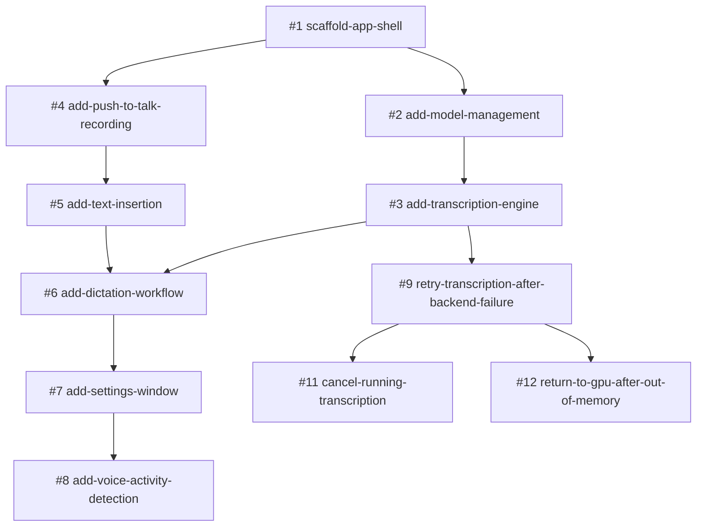
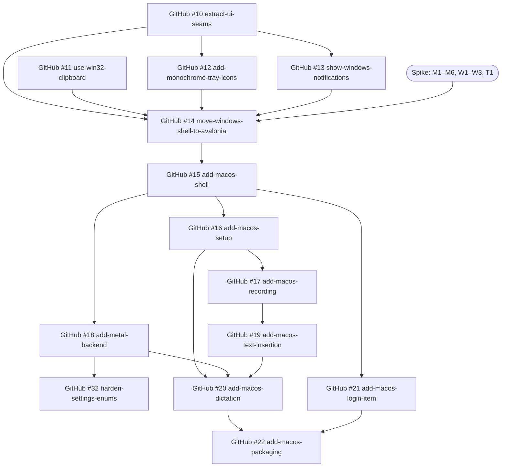

# Pisum Transcribe Roadmap

This roadmap covers v1 of Pisum Transcribe, the push-to-talk dictation app described in [idea.md](idea.md), and the [macOS port](#macos-port) that follows it. Each step is one GitHub issue and one OpenSpec change in `openspec/changes/<change>/`. Implement a change with `/opsx:apply <change>`, and archive it with `/opsx:archive <change>` once it is done.

## Dependency graph

## Order

v1 was tracked in an internal GitLab project. The issue numbers in this table and the graph, and the issue and merge request numbers in the archived changes (`#1` to `#14`, `!7`, `!11`), refer to that tracker, not to GitHub.

| Step | Issue | OpenSpec change | Blocked by | Delivers |
|---|---|---|---|---|
| 1 | #1 | `scaffold-app-shell` | – | WPF tray app, single instance, logging, settings storage, xunit v3 test project |
| 2 | #2 | `add-model-management` | #1 | Canary model catalog, verified download, first-run setup window |
| 3 | #3 | `add-transcription-engine` | #2 | Warm Canary engine, Vulkan→CPU fallback, German→English translation by default |
| 4 | #4 | `add-push-to-talk-recording` | #1 | Global hold-to-talk hotkey (Right Ctrl), 16 kHz mono microphone recording |
| 5 | #5 | `add-text-insertion` | #4 | Paste at cursor with clipboard restore, type-text fallback, elevated and changed window handling |
| 6 | #6 | `add-dictation-workflow` | #3, #5 | **MVP:** hold, speak, release, text appears; overlay, tray states, notifications |
| 7 | #7 | `add-settings-window` | #6 | Settings UI with live apply, model download and delete, autostart |
| 8 | #8 | `add-voice-activity-detection` | #7 | Silero VAD silence trimming, no transcription for silent clips |
| 9 | #9 | `retry-transcription-after-backend-failure` | #3 | A dictation that fails on the GPU is transcribed on the CPU instead of lost |
| 10 | #11 | `cancel-running-transcription` | #9 | Cancel a dictation while it is transcribed |
| 11 | #12 | `return-to-gpu-after-out-of-memory` | #9 | Back to the GPU after an out-of-memory error on a long dictation |

After v1, the issues are on GitHub:

| Step | Issue | OpenSpec change | Blocked by | Delivers |
|---|---|---|---|---|
| 12 | [GitHub #1](https://github.com/mschnecke/pisum-transcribe/issues/1) | `add-packaging-ci` | – | CI on every pull request and push to `main`, a self-contained zip on GitHub Releases, complete third-party notices |
| 13 | [GitHub #6](https://github.com/mschnecke/pisum-transcribe/issues/6) | `add-msi-installer` | GitHub #1 | A per-user MSI instead of the zip, without administrator rights: Start Menu shortcut, upgrades in place, uninstall that keeps the user's data |
| 14 | [GitHub #2](https://github.com/mschnecke/pisum-transcribe/issues/2) | `add-update-check` | GitHub #6 | A notice when a new version is released: a daily check of GitHub's latest release, a tray item and a notification, and an option to turn it off |

## Phases

### Phase 1: Foundation (#1)
Everything else builds on the scaffold, so it must come first.

### Phase 2: Two parallel tracks (#2 → #3, and #4 → #5)
After #1, two tracks have no dependency on each other:
- **Engine track:** #2 model management, then #3 transcription engine.
- **Input and output track:** #4 hotkey and recording, then #5 text insertion.

**Checkpoint after #3:** run the explicit benchmark tests on the target laptop (ThinkPad E14 Gen 7, Intel Xe). The target is warm transcription of a 10 s clip well under 3 s. If Vulkan is slower than CPU or unstable, or Q4_K_M matches Q8_0 in accuracy, change the default backend or model before #6.

### Phase 3: MVP (#6)
The dictation workflow joins both tracks. After #6, the app is usable end to end with the settings in `settings.json`.

### Phase 4: Polish (#7 → #8)
- #7 settings window makes every option configurable without editing JSON.
- #8 voice activity detection depends on #7 only for its settings checkbox.

### Phase 5: Hardening (#9 → #11, #12)
- #9 keeps a dictation when the GPU fails.
- #11 and #12 build on #9 and don't depend on each other.

## macOS port

Pisum Transcribe is to ship on macOS as a public release next to Windows. Avalonia UI becomes the shell on both platforms. Windows moves to it first, as a release of its own, after four smaller changes that prepare the move on the WPF shell. The decisions behind the port were made in explore mode on 2026-09-22. They are recorded in the designs of `move-windows-shell-to-avalonia` and `add-macos-shell`. The latter's section "Decided for later macOS changes" covers the steps that have no OpenSpec change yet.

### Dependency graph

### Order

| Step | Issue | OpenSpec change | Blocked by | Delivers |
|---|---|---|---|---|
| 15 | [GitHub #10](https://github.com/mschnecke/pisum-transcribe/issues/10) | `extract-ui-seams` | – | `IUiDispatcher`, `TrayStatus`, `INotifier` and `Windows/` folders. No visible change |
| 16 | [GitHub #11](https://github.com/mschnecke/pisum-transcribe/issues/11) | `use-win32-clipboard` | – | The clipboard on the Win32 API, without WPF. No visible change |
| 17 | [GitHub #12](https://github.com/mschnecke/pisum-transcribe/issues/12) | `add-monochrome-tray-icons` | GitHub #10 | A monochrome microphone that follows the taskbar's mode, red while recording, amber while transcribing |
| 18 | [GitHub #13](https://github.com/mschnecke/pisum-transcribe/issues/13) | `show-windows-notifications` | GitHub #10 | Notifications as Windows toasts from "Pisum Transcribe". Windows 10 version 2004 or later |
| 19 | [GitHub #14](https://github.com/mschnecke/pisum-transcribe/issues/14) | `move-windows-shell-to-avalonia` | GitHub #10–#13, the spike | The Avalonia shell on Windows, the last Windows step before the macOS track. A left click on the tray icon opens the settings |
| 20 | [GitHub #15](https://github.com/mschnecke/pisum-transcribe/issues/15) | `add-macos-shell` | GitHub #14 | The Mac build as a menu bar app: quit and logout, data folders, the Swift helper, a dev bundle, macOS CI |
| 21 | [GitHub #16](https://github.com/mschnecke/pisum-transcribe/issues/16) | `add-macos-setup` | GitHub #15 | One setup window for the model and the permissions |
| 22 | [GitHub #17](https://github.com/mschnecke/pisum-transcribe/issues/17) | `add-macos-recording` | GitHub #16 | Hold right Command to record, with microphone and secure-input handling |
| 23 | [GitHub #18](https://github.com/mschnecke/pisum-transcribe/issues/18) | `add-metal-backend` | GitHub #15 | Metal with CPU fallback, the GPU setting renamed with a migration, the M4 benchmark |
| 24 | [GitHub #19](https://github.com/mschnecke/pisum-transcribe/issues/19) | `add-macos-text-insertion` | GitHub #17 | Paste with restore, typing when the pasteboard can't be read, the secure-input hint |
| 25 | [GitHub #20](https://github.com/mschnecke/pisum-transcribe/issues/20) | `add-macos-dictation` | GitHub #16, #18, #19 | **Mac MVP:** hold, speak, release, text appears |
| 26 | [GitHub #21](https://github.com/mschnecke/pisum-transcribe/issues/21) | `add-macos-login-item` | GitHub #15 | Open at login |
| 27 | [GitHub #22](https://github.com/mschnecke/pisum-transcribe/issues/22) | `add-macos-packaging` | GitHub #20, #21 | An unsigned `.pkg` with the project's own certificate, upgrades like the MSI's, a Homebrew tap, lockstep releases |
| 28 | [GitHub #32](https://github.com/mschnecke/pisum-transcribe/issues/32) | `harden-settings-enums` | GitHub #18 | An unknown setting value falls back to its default, instead of resetting every setting, for example after a downgrade |

**Planning state on 2026-09-23:**
- **Done:** GitHub #10–#13, merged in pull requests #24–#27. GitHub #13's registration was checked on Windows 11 only. The check on Windows 10 22H2 was skipped, so the shortcut fallback in its design D2 still applies if toasts don't show there.
- **The spike** is done: the macOS half on 2026-09-22 and the Windows half on 2026-09-23, both go.
- **GitHub #14** is implemented on its branch. The regression pass by hand against the specs, on Windows 11 and Windows 10 22H2, is still open.
- **GitHub #15** is implemented on its branch, and its checks by hand on the Mac passed. The Windows run of its tests and the checks by hand on Windows 11 (its tasks 10.1 and 10.3) are still open.
- **GitHub #16** is implemented on its branch. Its first start by hand on the Mac (its task 6.1) and the Windows run of its tests are still open.
- **GitHub #17** is implemented on its branch: the hotkey and the microphone on macOS, with right Command as the default hotkey there. Its checks by hand on the Mac and CI on both platforms passed; a user switch and a password field weren't checked by hand. fn isn't a hotkey key on macOS, because the keyboard hook never sees it held.
- **GitHub #18–#22** have no OpenSpec change yet.

### Releases

| Release | Contains | Installers |
|---|---|---|
| 1.2.0 | GitHub #10–#13 | MSI |
| 1.3.0 | GitHub #14 | MSI |
| 1.4.0 | GitHub #15–#22 | MSI and `.pkg`, the first lockstep release |

- **Between 1.3.0 and 1.4.0,** the macOS steps land in `main`, and CI builds and tests the Mac target, but no macOS installer is released. Windows fixes ship as MSI-only patch releases.
- **GitHub #18's settings migration** reaches Windows users with the first release that contains it.
- **From 1.4.0 on,** one tag gives one release with both installers, published only when both builds pass.

### Phases

#### Phase 6: Windows preparation (GitHub #10–#13)
These are no-regret changes on the WPF shell. They're needed whichever shell macOS gets, so they don't wait for the spike. #10 and #11 are independent, and #12 and #13 build on #10. They ship as 1.2.0.

**Checkpoint, the spike:** a throwaway branch before GitHub #14.
- **M1–M4 on the development Mac:** an agent app with a menu bar icon, an overlay that leaves TextEdit focused (also in full screen), SharpHook next to Avalonia's main loop, and Quit and logout.
- **M5:** macOS's pasteboard privacy alert.
- **M6:** permission grants across builds signed with one certificate.
- **W1–W3 on Windows:** the overlay styles, session end, and the tray.
- **T1:** headless tests on xunit v3.
- If the overlay takes focus on macOS even as a native `NSPanel`, stop before #14 and decide the shell again.

#### Phase 7: The Avalonia shell (GitHub #14)
The swap from WPF to Avalonia, checked against the existing specs. It ships as 1.3.0.

#### Phase 8: The macOS track (GitHub #15–#21)
- After #15, #16 setup comes first, followed by #17 recording and #19 text insertion. #17 builds on #16's permission checks, its microphone status and its relaunch after the Accessibility grant. #18 Metal runs in parallel with them.
- #21 depends only on #15.
- #32 depends only on #18, whose settings format version and migration it builds on. It hardens the settings on both platforms and doesn't block the Mac MVP.
- #20 joins the tracks into the Mac MVP.

**Checkpoint after #18:** run the benchmark on the development Mac, a MacBook Air M4 with 16 GB.
- The target is warm transcription of a 10 s clip well under 3 s.
- Compare Metal with the CPU, and Q8_0 with Q4_K_M.
- Run long clips up to 399 s on Metal, to see whether the out-of-memory return matters on unified memory.
- If Metal is slower than the CPU or unstable, or Q4_K_M matches Q8_0, change the Mac defaults before #20.

#### Phase 9: The first lockstep release (GitHub #22)
The `.pkg`, its signing and its upgrade behavior. It ships as 1.4.0, with the MSI.

## Deferred (not planned yet)

- Distribution: WinGet and Chocolatey packages, code signing of the MSI, and updating in one click, which waits for signing. The Chocolatey package id is `pisum-transcribe`, because `pisum-transcript` on the MyGet feed belongs to the old Pisum Transcript app and has versions up to 1.0.5.
  - A self-signed certificate gives Windows users nothing: SmartScreen treats it like no signature.
  - SignPath Foundation signs open-source projects for free, with "SignPath Foundation" as the publisher shown.
- macOS without an Apple Developer Program membership:
  - Developer ID signing and notarization aren't possible, so the `.pkg` ships unsigned (GitHub #22).
  - The official Homebrew cask repository has been closed to apps that aren't notarized since 2026-09-01. A tap of the project's own is proposed in GitHub #22.
- macOS on Intel Macs, a universal build, and macOS 13 or earlier.
- For the sister project pisum-whisper:
  - the `.pkg` upgrade rules and the self-signed certificate from GitHub #22
  - its `MacOsClipboard` comment that nothing public keeps an entry off Universal Clipboard, which the SDK's `NSPasteboardContentsCurrentHostOnly` contradicts
- Confirm the Canary model license before public distribution. Hugging Face lists CC-BY-4.0, while transcribe.cpp's docs say Apache-2.0.
- Items listed as non-goals in the changes: microphone device picker, download resume, UI localization, sherpa-onnx engine.
