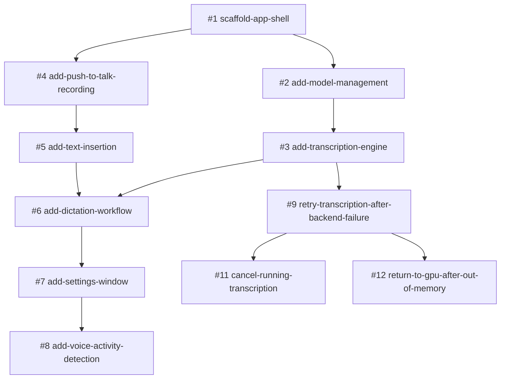

# Pisum Transcribe Roadmap

This roadmap covers v1 of Pisum Transcribe, the push-to-talk dictation app described in [idea.md](idea.md). Each step is one GitHub issue and one OpenSpec change in `openspec/changes/<change>/`. Implement a change with `/opsx:apply <change>`, and archive it with `/opsx:archive <change>` once it is done.

## Dependency graph

## Order

v1 was tracked in an internal GitLab project. The issue numbers in this table and the graph, and the issue and merge request numbers in the archived changes (`#1` to `#14`, `!7`, `!11`), refer to that tracker, not to GitHub.

| Step | Issue | OpenSpec change | Blocked by | Delivers |
|---|---|---|---|---|
| 1 | #1 | `scaffold-app-shell` | – | WPF tray app, single instance, logging, settings storage, xunit v3 test project |
| 2 | #2 | `add-model-management` | #1 | Canary model catalog, verified download, first-run setup window |
| 3 | #3 | `add-transcription-engine` | #2 | Warm Canary engine, Vulkan→CPU fallback, German→English translation by default |
| 4 | #4 | `add-push-to-talk-recording` | #1 | Global hold-to-talk hotkey (Right Ctrl), 16 kHz mono microphone recording |
| 5 | #5 | `add-text-insertion` | #4 | Paste at cursor with clipboard restore, type-text fallback, elevated and changed window handling |
| 6 | #6 | `add-dictation-workflow` | #3, #5 | **MVP:** hold, speak, release, text appears; overlay, tray states, notifications |
| 7 | #7 | `add-settings-window` | #6 | Settings UI with live apply, model download and delete, autostart |
| 8 | #8 | `add-voice-activity-detection` | #7 | Silero VAD silence trimming, no transcription for silent clips |
| 9 | #9 | `retry-transcription-after-backend-failure` | #3 | A dictation that fails on the GPU is transcribed on the CPU instead of lost |
| 10 | #11 | `cancel-running-transcription` | #9 | Cancel a dictation while it is transcribed |
| 11 | #12 | `return-to-gpu-after-out-of-memory` | #9 | Back to the GPU after an out-of-memory error on a long dictation |

After v1, the issues are on GitHub:

| Step | Issue | OpenSpec change | Blocked by | Delivers |
|---|---|---|---|---|
| 12 | [GitHub #1](https://github.com/mschnecke/pisum-transcript/issues/1) | `add-packaging-ci` | – | CI on every pull request and push to `main`, a self-contained zip on GitHub Releases, complete third-party notices |
| 13 | [GitHub #6](https://github.com/mschnecke/pisum-transcript/issues/6) | `add-msi-installer` | GitHub #1 | A per-user MSI instead of the zip, without administrator rights: Start Menu shortcut, upgrades in place, uninstall that keeps the user's data |
| 14 | [GitHub #2](https://github.com/mschnecke/pisum-transcript/issues/2) | `add-update-check` | GitHub #6 | A notice when a new version is released: a daily check of GitHub's latest release, a tray item and a notification, and an option to turn it off |

## Phases

### Phase 1: Foundation (#1)
Everything else builds on the scaffold, so it must come first.

### Phase 2: Two parallel tracks (#2 → #3, and #4 → #5)
After #1, two tracks have no dependency on each other:
- **Engine track:** #2 model management, then #3 transcription engine.
- **Input and output track:** #4 hotkey and recording, then #5 text insertion.

**Checkpoint after #3:** run the explicit benchmark tests on the target laptop (ThinkPad E14 Gen 7, Intel Xe). The target is warm transcription of a 10 s clip well under 3 s. If Vulkan is slower than CPU or unstable, or Q4_K_M matches Q8_0 in accuracy, change the default backend or model before #6.

### Phase 3: MVP (#6)
The dictation workflow joins both tracks. After #6, the app is usable end to end with the settings in `settings.json`.

### Phase 4: Polish (#7 → #8)
- #7 settings window makes every option configurable without editing JSON.
- #8 voice activity detection depends on #7 only for its settings checkbox.

### Phase 5: Hardening (#9 → #11, #12)
- #9 keeps a dictation when the GPU fails.
- #11 and #12 build on #9 and don't depend on each other.

## Deferred (not planned yet)

- Distribution: WinGet and Chocolatey packages, code signing, and updating in one click, which waits for signing. The Chocolatey package id is `pisum-transcribe`, because `pisum-transcript` on the MyGet feed belongs to the old Pisum Transcript app and has versions up to 1.0.5.
- Confirm the Canary model license before public distribution. Hugging Face lists CC-BY-4.0, while transcribe.cpp's docs say Apache-2.0.
- Items listed as non-goals in the changes: microphone device picker, download resume, UI localization, sherpa-onnx engine.
